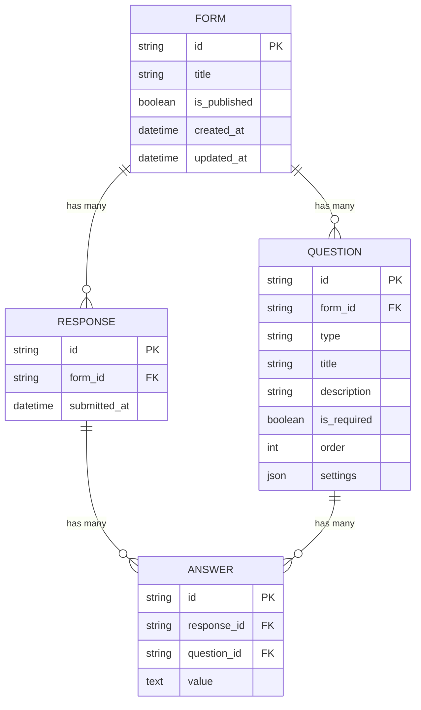

# Typeform Builder Clone

A functional clone of Typeform built as a Fullstack assignment. 

## Features

- **Form Builder**: Drag-and-drop question ordering, question settings, live preview.
- **Respondent Flow**: One-question-at-a-time, keyboard navigation, smooth transitions.
- **Results View**: Table view of all submissions.
- **Dashboard**: Manage multiple forms.

## Tech Stack

- **Frontend**: Next.js 14 (App Router), React, TypeScript, Tailwind CSS, Framer Motion, dnd-kit
- **Backend**: FastAPI (Python), SQLAlchemy, Pydantic, SQLite
- **Database**: SQLite (local)

## Architecture Overview

The application is split into a Next.js frontend and a FastAPI backend.
- The **backend** provides RESTful API endpoints to perform CRUD operations on Forms, Questions, and Responses. It uses SQLAlchemy ORM to interact with a SQLite database.
- The **frontend** uses the App Router paradigm. State is managed locally in React components. Animations are powered by Framer Motion to mimic the signature Typeform respondent flow. Drag and drop in the builder uses `@dnd-kit/core`.

## Database Schema



## Setup Instructions

### 1. Backend Setup

```bash
cd backend
python -m venv venv
source venv/bin/activate
pip install -r requirements.txt
python seed.py # Optional: Seeds the DB with sample forms
uvicorn main:app --reload --port 8000
```

### 2. Frontend Setup

```bash
cd frontend
npm install
npm run dev
```

The frontend will be available at `http://localhost:3000`.

## Assumptions Made

- Real authentication is mocked (assumes a default logged-in creator).
- No complex branching or logic jumps were implemented in this version to keep the scope manageable, focusing on the core experience.
